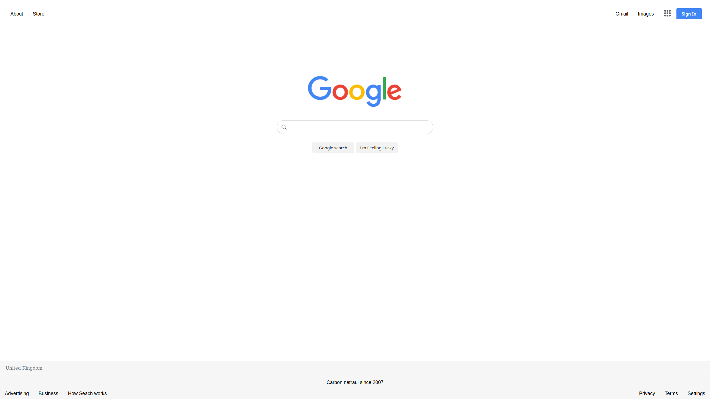

Google Homepage Project

In this project I use HTML/CSS to (visually) replicate the Google homepage.

The site does include hover buttons, links and is resizeable.
The footer is permenantly at the bottom of the page.
Also an icon link has been added.

The Link to the live version is <a href="https://ravip14.github.io/google-homepage/">here.</a>

